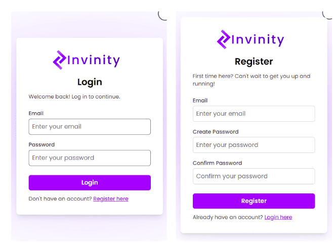
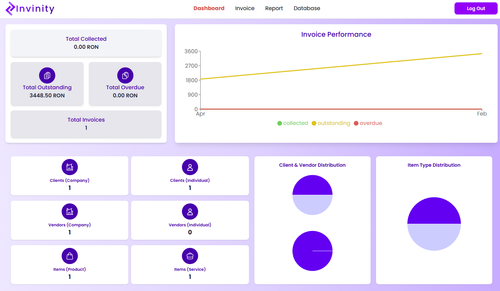
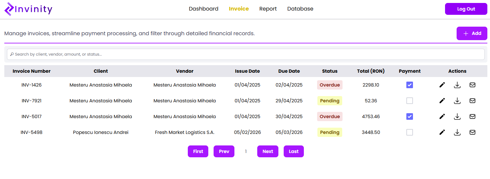
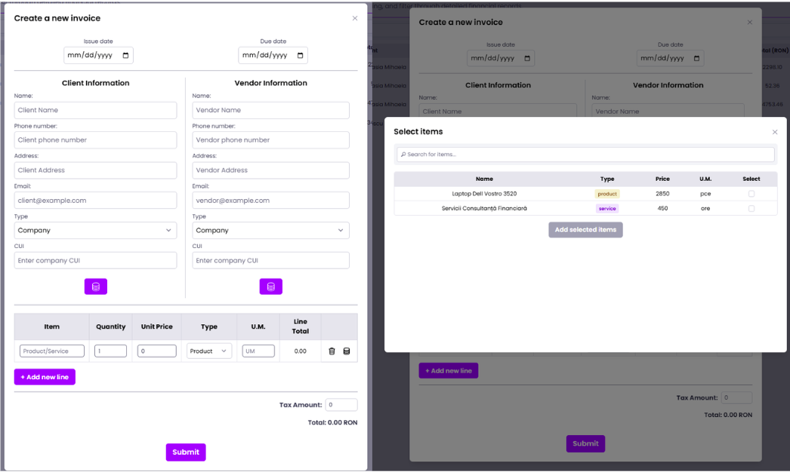
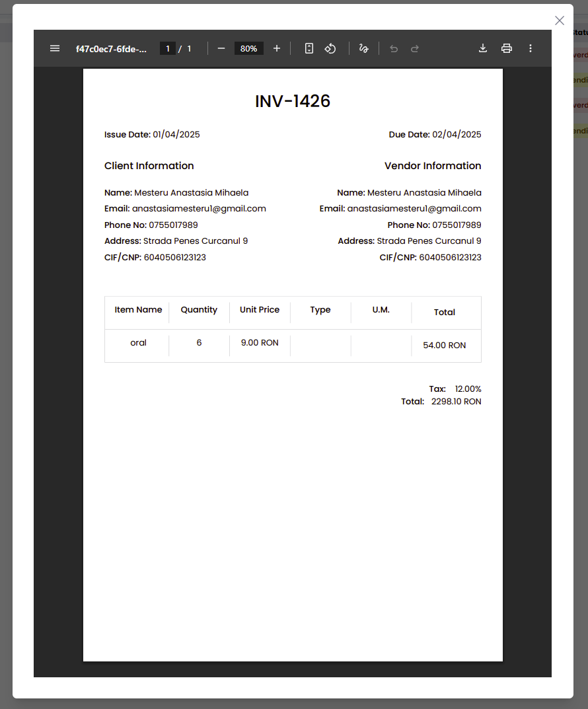
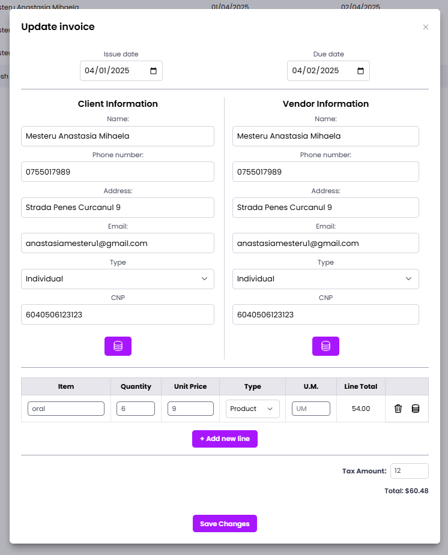
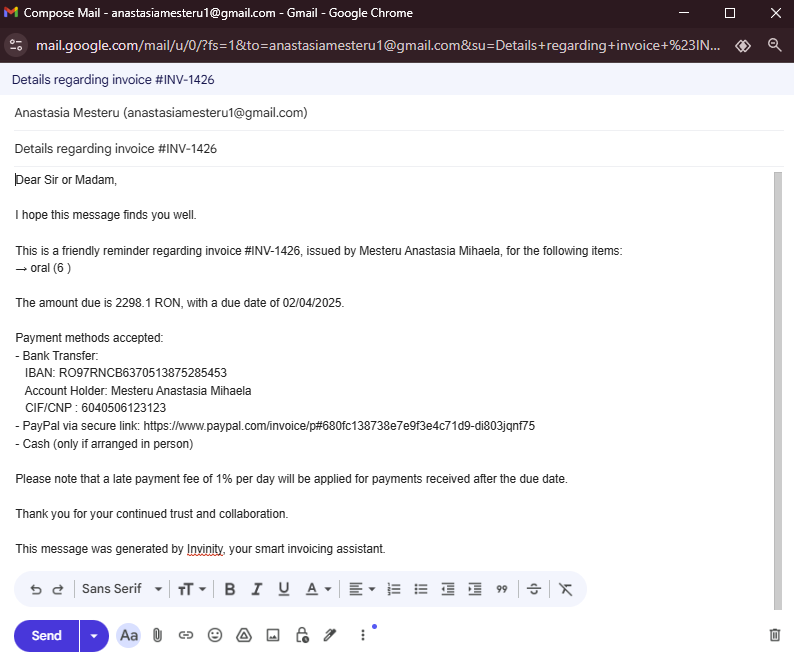
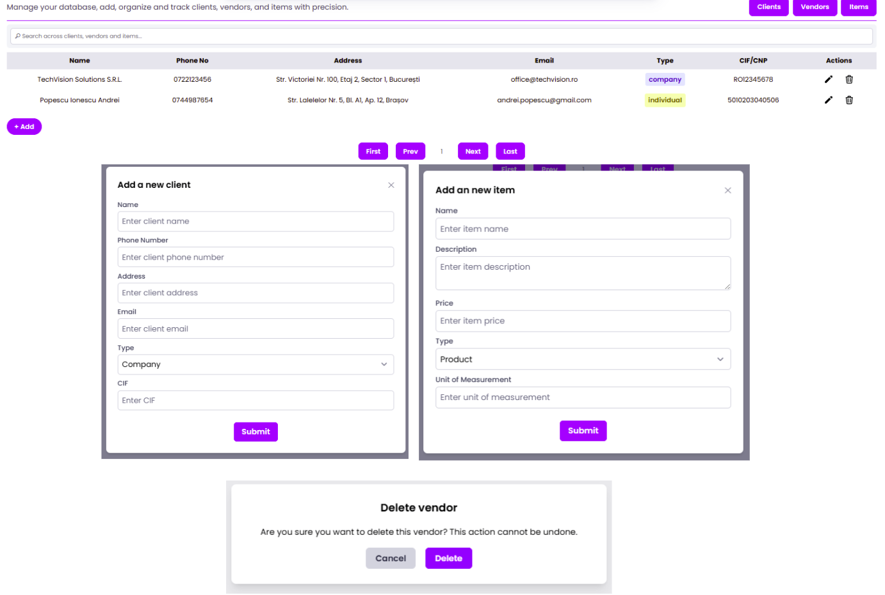

# Invinity - E-Invoicing Appliation

Invinity is a robust invoicing web application  designed to streamline financial workflows for freelancers and small businesses. By bridging the gap between complex accounting software and manual spreadsheets, Invinity offers a user-centric platform to manage the entire billing lifecycle.

## Technology stack
Invinity was developed using VS Code for streamlined coding and GitHub for secure, version-controlled repository management. During the engineering of the back-end, Postman was essential for debugging and testing RESTful API endpoints, ensuring seamless data flow between the client and server.

Based on the three-layer architecture chosen for the invoice application, the stack used is MERN,  pre-built technology stack based on JavaScript technologies. This stack was chosen because it makes the deployment of full-stack web applications easier and faster.

### Presentation Layer(Front-end)
Developed using React and Vite, focusing on a highly responsive UI/UX. Styling is handled via Tailwind CSS, featuring a custom purple-themed aesthetic designed for clarity and professional appeal.
### Application Layer(Back-end)
Powered by Node.js and Express.js, this layer manages the core business logic, including JWT-based authentication, server-side PDF generation, financial calculations and graphs.
### Data Layer(Database)
Utilizes MongoDB and Mongoose to provide a flexible, schema-based NoSQL storage solution for managing complex entity relationships (Clients, Vendors, Invoices and Reports).

## Visual Overview
### Authentication
The first page the user is brought to is the login page. If the user doesn’t have an account, they can navigate to the registration form using the “Register here” button at the bottom of the form. 

  
   
  <b>Figure 1:</b> <i>Secure Log In and Registration forms for Invinity users.</i>

### Navbar
The navbar contains the logo for Invinity and the four main pages: Dashboard, the default landing page after logging in, Invoice, Report and Database. Additionally, there is a Log Out button, which redirects the user to the login page.

### Dashboard
The dashboard of Invinity presents a personalized, small breakdown of invoicing activities. On the left side of the dashboard, users can view a breakdown of the current month’s financial status, including total number of invoices created during the current month, total collected, total oustanding and total overdue. On the right side of the dashboard, a line chart displays the totals for the entire year.

  
   
  <b>Figure 2:</b> <i>The Invinity Dashboard providing a real-time financial breakdown, annual trends, and database entity counts.</i>

At the bottom of the page, there is a breakdown of the entities in the user’s database, categorized by type.

### Invoice Page
The Invoice page of Invinity allows users to manage, track and update their invoices as needed. Users can search for a specific invoice by using the Search functionality and typing any of its attributes, such as client, issue date, or status. Invoices are displayed in a table with details such as Invoice Number, Client, Vendor, Issue Date, Due Date, Status, Total, Payment. The Status column will automatically update based on the payment checkbox: when checked, it will reflect whether the invoice is On Time or Overdue and if unchecked, it will display as Pending. 

The Actions column displays 3 icons: the first for editing the invoice, the second for downloading it as a PDF, and the third for emailing the invoice details to the client. 

The Add button at the top of the page allows users to create a new invoice, while the pagination controls at the bottom help navigate through multiple pages of records, even when they are sorted or queried.

   
  <b>Figure 3:</b> <i>The Invoice Management interface featuring automated status tracking and integrated search functionality.</i>

The Add button opens a form where the user can enter all necessary invoice details. If any data is entered incorrectly or left incomplete, error messages will appear to guide the user upon pressing the submit button. Additionally, there are three database icon buttons that allow users to directly select clients, vendors, or items from their personalized database.

   
  <b>Figure 4:</b> <i>User adding a new invoice and selecting items from the database.</i>

The button represented by a download icon allows the user to export the respective invoice as a PDF. When clicked, it will display a modal with the generated document.  

   
  <b>Figure 5:</b> <i>PDF document of the invoice, ready to download.</i>

The button represented by the crayon icon will open a modal with all the selected invoice’s data. 

   
  <b>Figure 6:</b> <i>User editing the details of the invoice.</i>

The last button handles the emailing functionality. When pressed, the button opens a separate window prefilled with the client’s email and an auto-generated message, which includes invoice details and summarizes the available methods of payment.  

   
  <b>Figure 7:</b> <i>User sending the details of the invoice via email.</i>

### Report Page
The Report page of Invinity has mostly the same structure as the Invoice one. The reports are displayed in a table with columns such as Report Number, Title, Start Date and End Date, meaning the time period covered by the report. In this page the user can create a new report using the add button, edit, delete or export as PDF.

   
  <b>Figure 8:</b> <i>Report Page Functionalities.</i>

### Database Page

The database page is split into 3 sections: clients, vendors and items. Cients and vendors can be individuals or companies, while items can be products or services. On this page the user can only add or delete a specific entity, but these can be used to autocomplete information in the invoice.

   
  <b>Figure 9:</b> <i>Database Page Functionalities.</i>

